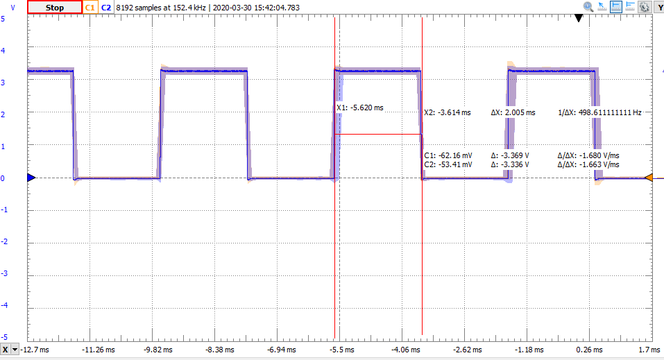

# uCos2
TM4C123 Build for micro C OS II


# Lab 4

## Part 1 - testing delay
The OSTimeDly function delays the task by its parameter in ms, so OSTimeDelay(2) should delay 2 ms. 

The blue LED was scoped with the following task running.

```c
static  void  Task2 (void *p_arg){
  uint8_t err;
  (void)p_arg;
  while (1) {              
    BSP_LED_Toggle(2);
    // OSMutexPend(UARTMutex, 0, &err); // acquire lock for the uart
    // UARTprintf("TABCDEFGHIJKLMNOPQRSTUV\n");  // Probably needs to be protected by semaphore
    // OSMutexPost(UARTMutex); // release lock for the uart
    // BSP_LED_Toggle(2);
    // OSTimeDlyHMSM(0, 0, 0, 1); // delay 1ms, without the mutex's this will make the UART's clash at 80MHz
    OSTimeDly(2);
  }
}
```

The result was the following waveform:



This confirms that it is correctly delaying for 2ms.

## Part 2

The experiment devised is to space out the LED toggles with a long, unprotected UART print. This causes some delay while still considering the thread active. If the priorities are enforced, multiple LEDs should be on at the same time since the higher priority tasks are toggle high before the low priority can toggle low.

* Task1: prio 5
* Task2: prio 4
* Task3: prio 3

```c
static  void  Task1 (void *p_arg)
{
  uint8_t err;
  (void)p_arg;
  while (1) {              
    BSP_LED_Toggle(1);
    //OSMutexPend(UARTMutex, 0, &err); // acquire lock for the uart
    UARTprintf("T1234567891011121314\n");T1234567891011121314// Probably needs to be protected by semaphore
    //OSMutexPost(UARTMutex); // release lock for the uart
    BSP_LED_Toggle(1);
    OSTimeDlyHMSM(0, 0, 0, 1);
    //OSTimeDly(2);
  }
}
```

This results in red and blue (and green) being on at the same time intermittently, confirming our priority test.


## Part 4

On the delay used in part 1 and 2 (2ms). The UART gets slammed and the text gets jumbled like so: 


With the mutex now protecting the printf like so... 

```c
static  void  Task1 (void *p_arg)
{
  uint8_t err;
  (void)p_arg;
  while (1) {              
    BSP_LED_Toggle(1);
    OSMutexPend(UARTMutex, 0, &err); // acquire lock for the uart
    UARTprintf("T1234567891011121314\n");T1234567891011121314// Probably needs to be protected by semaphore
    OSMutexPost(UARTMutex); // release lock for the uart
    BSP_LED_Toggle(1);
    OSTimeDlyHMSM(0, 0, 0, 2);
    //OSTimeDly(2);

  }
}
```

... the uart is now much more organized.


